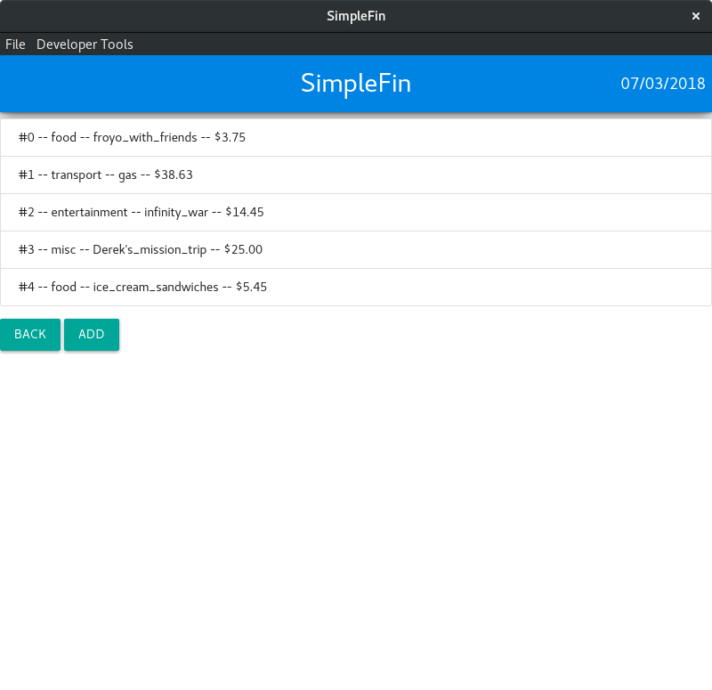

# simplefin
I was looking into personal finance apps and I didn't find anything that I liked.
Therefore, I decided to create my own simple app with the features I wanted.
SimpleFin is built with Javascript, HTML, and CSS.
The main framework that I used is Electron, which allows you to write cross-platform
desktop applications using what are normally only web technologies.
Aside from Electron, I also made use of Node.js and Plotly.js.

This is the main screen which displays information about current budgets and spending.
The main attraction here is the Plotly.js graph in the middle.

After clicking on the "Manage Transactions" button, a new screen appears with a
list of all your transactions.

Adding a transaction will bring up a new window to enter the data into.

After entering the data, the transaction is added to the list and the amount is
used to recalculate results for the main screen.
